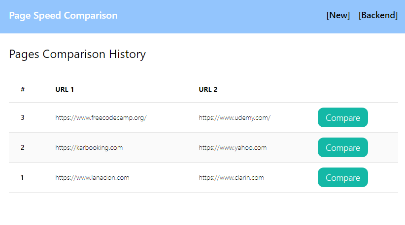

# Full Stack - Page Speed Comparison

## Descripción
Page Speed Comparison es una aplicación que compara dos valores de SEO como 'Seed Index' y 'Time to Interactive' entre dos sitios.
Posee un Frontend para ingresar las dos URLs a comparar y un Backend que procesa estas URLs con la API de google Pagespeed y almacena también los históricos para ser procesados en cualquier momento.
El mismo está realizado con Django, MySQL y Docker, pero también puede funcionar solo con Django y SQLite.
También se utilizó Tailwind CSS para los estilos del sitio.

## Iniciar la aplicación
Se puede iniciar la app de dos formas:

1. Solo con Django y SQLite:
    ```bash
    python manage.py runserver
    ```
2. Con Docker, Django y MySQL:
    ```bash
    docker-compose up --build
    ```
3. Luego acceder en un navegador a http://localhost:8000

## Frontend

1. Página inicial:

    En la misma se puede crear nuevas URLs, y registrar o loguearse como usuario:

    

2. Crear nueva comparación:

    Se puede crear desde el menú [New] o desde el link Create New Comparison:

    


## Backend

3. Sign up:

    Para poder acceder al Backend se debe registar un usuario:

    


4. Login:

    Luego se puede loguear con el usuario creado en el paso anterior, o con un usuario ya existente:

    


5. Home:

    Luego del login se puede acceder al menú [Backend]:

    


6. Histórico de comparaciones:

    Se observan los históricos de comparaciones ordenados desde el último:

    

7. Seleccionar registro a comparar:

    Seleccionar el registro presionando en el botón "Compare":

    

8. Comparar:
    
    Presionar el botón "Get Speed!" y esperar a que finalice el proceso:

    

9. Visualización de resultados:
    
    Se visualizan los resultados en la tabla de comparación:

    
